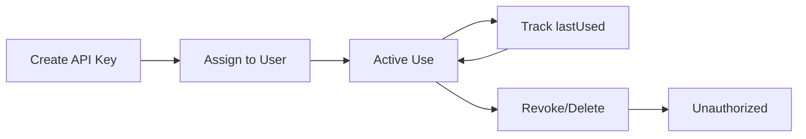

## Overview

The Faction API uses **API key authentication** to secure all endpoints. Every API request must include a valid API key in the request header.

## Authentication Method

API keys are passed via the `FACTION-API-KEY` HTTP header:

```bash
FACTION-API-KEY: your-api-key-here
```

### Authentication Flow

1. Client sends request with `FACTION-API-KEY` header
2. Server validates the API key against the database
3. Server retrieves the associated user account
4. Server checks user permissions for the requested operation
5. Request is processed or denied based on permissions

## Getting an API Key

There are two ways to obtain an API key:

### 1. User Profile (Self-Service)

<Steps>
  <Step title="Log into Faction">
    Sign in to the Faction web interface with your credentials
  </Step>
  
  <Step title="Navigate to Profile">
    Go to your user profile settings
  </Step>
  
  <Step title="Generate API Key">
    Click "Generate API Key" or "Create New Key"
  </Step>
  
  <Step title="Copy and Store">
    Copy your API key immediately. For security, it may not be shown again.
  </Step>
</Steps>

### 2. Admin Creation

Administrators can create API keys for other users:

<Steps>
  <Step title="Access User Management">
    Navigate to the user management interface (requires Manager permissions)
  </Step>
  
  <Step title="Select User">
    Choose the user who needs an API key
  </Step>
  
  <Step title="Generate Key">
    Create an API key for the selected user
  </Step>
  
  <Step title="Distribute Securely">
    Provide the API key to the user through a secure channel
  </Step>
</Steps>

## API Key Properties

Each API key in the system has the following properties:

| Property | Type | Description |
|----------|------|-------------|
| `key` | String | The actual API key value (UUID format) |
| `user` | User | Associated user account |
| `created` | Date | When the key was created |
| `lastUsed` | Date | Last successful authentication timestamp |

<Note>
API keys automatically track usage. The `lastUsed` field is updated on each successful authentication.
</Note>

## Permissions and Scopes

API keys inherit the permissions of their associated user account. Faction uses role-based access control:

### User Roles

<AccordionGroup>
  <Accordion title="Assessor" icon="user-secret">
    **Permissions:**
    - View assigned assessments
    - Create and modify vulnerabilities
    - Access vulnerability templates
    - Update assessment notes and findings
    
    **API Access:**
    - `GET /api/assessments/queue` - View assigned assessments
    - `POST /api/assessments/addVuln/{aid}` - Add vulnerabilities
    - `GET /api/assessments/vuln/{vid}` - View vulnerability details
    - `GET /api/vulnerabilities/default` - Access vulnerability templates
  </Accordion>

  <Accordion title="Manager" icon="user-tie">
    **Permissions:**
    - All Assessor permissions
    - View all assessments (not just assigned)
    - Manage users and API keys
    - Create and modify vulnerability templates
    - Access administrative functions
    
    **API Access:**
    - All assessment endpoints (unrestricted)
    - `POST /api/vulnerabilities/default` - Create vulnerability templates
    - `POST /api/vulnerabilities/category` - Manage categories
    - User management endpoints
  </Accordion>

  <Accordion title="Engagement" icon="handshake">
    **Permissions:**
    - Create new assessments
    - View engagement contact assessments
    - Update assessment metadata
    - Access assessment reports
    
    **API Access:**
    - `POST /api/assessments/create` - Create assessments
    - `GET /api/assessments/{aid}` - View accessible assessments
    - `POST /api/assessments/{aid}` - Update assessment fields
  </Accordion>

  <Accordion title="Remediation" icon="wrench">
    **Permissions:**
    - View assigned vulnerabilities
    - Update vulnerability status
    - Set tracking IDs
    - Mark vulnerabilities as fixed
    
    **API Access:**
    - `GET /api/vulnerabilities/getvuln/{id}` - View vulnerability details
    - `POST /api/vulnerabilities/settracking` - Assign tracking numbers
    - `POST /api/vulnerabilities/setstatus` - Update remediation status
    - `GET /api/vulnerabilities/gettracking/{track}` - Search by tracking ID
  </Accordion>
</AccordionGroup>

## Making Authenticated Requests

### cURL Example

```bash
curl -X GET \
  https://faction.example.com/api/assessments/queue \
  -H 'FACTION-API-KEY: 12345678-abcd-1234-efgh-567890abcdef' \
  -H 'Content-Type: application/json'
```

### Python Example

```python
import requests

API_KEY = '12345678-abcd-1234-efgh-567890abcdef'
BASE_URL = 'https://faction.example.com/api'

headers = {
    'FACTION-API-KEY': API_KEY,
    'Content-Type': 'application/json'
}

response = requests.get(
    f'{BASE_URL}/assessments/queue',
    headers=headers
)

if response.status_code == 200:
    assessments = response.json()
    print(f"Found {len(assessments)} assessments")
else:
    print(f"Error: {response.status_code} - {response.text}")
```

### JavaScript Example

```javascript
const API_KEY = '12345678-abcd-1234-efgh-567890abcdef';
const BASE_URL = 'https://faction.example.com/api';

fetch(`${BASE_URL}/assessments/queue`, {
  method: 'GET',
  headers: {
    'FACTION-API-KEY': API_KEY,
    'Content-Type': 'application/json'
  }
})
.then(response => {
  if (!response.ok) {
    throw new Error(`HTTP error! status: ${response.status}`);
  }
  return response.json();
})
.then(data => {
  console.log('Assessments:', data);
})
.catch(error => {
  console.error('Error:', error);
});
```

### PowerShell Example

```powershell
$apiKey = '12345678-abcd-1234-efgh-567890abcdef'
$baseUrl = 'https://faction.example.com/api'

$headers = @{
    'FACTION-API-KEY' = $apiKey
    'Content-Type' = 'application/json'
}

$response = Invoke-RestMethod `
    -Uri "$baseUrl/assessments/queue" `
    -Method Get `
    -Headers $headers

Write-Host "Found $($response.Count) assessments"
```

## Authentication Errors

If authentication fails, you'll receive a `401 Unauthorized` response:

```json
[{
  "result": "ERROR",
  "message": "Not Authorized."
}]
```

### Common Causes

<AccordionGroup>
  <Accordion title="Missing API Key Header">
    **Problem:** The `FACTION-API-KEY` header is not included in the request.
    
    **Solution:** Ensure every request includes the header:
    ```bash
    -H 'FACTION-API-KEY: your-key-here'
    ```
  </Accordion>

  <Accordion title="Invalid API Key">
    **Problem:** The API key does not exist in the database or has been deleted.
    
    **Solution:** 
    - Verify the API key is correct (check for typos)
    - Generate a new API key if the old one was deleted
    - Contact your administrator if you don't have access
  </Accordion>

  <Accordion title="Insufficient Permissions">
    **Problem:** The user account lacks the required role for the operation.
    
    **Solution:**
    - Check the endpoint documentation for required permissions
    - Contact your administrator to request elevated permissions
    - Use an API key from an account with appropriate access
  </Accordion>
</AccordionGroup>

## Security Best Practices

<CardGroup cols={2}>
  <Card title="Use Environment Variables" icon="code">
    ```bash
    export FACTION_API_KEY="your-key-here"
    curl -H "FACTION-API-KEY: $FACTION_API_KEY" ...
    ```
    Never hardcode API keys in your source code.
  </Card>

  <Card title="Rotate Keys Regularly" icon="rotate">
    Periodically generate new API keys and revoke old ones, especially after team member departures.
  </Card>

  <Card title="Use HTTPS Only" icon="lock">
    Always use HTTPS to prevent API keys from being intercepted in transit.
  </Card>

  <Card title="Limit Key Scope" icon="shield-halved">
    Create separate API keys for different integrations with minimum required permissions.
  </Card>

  <Card title="Monitor Usage" icon="chart-line">
    Track API key usage through the `lastUsed` field to detect unauthorized access.
  </Card>

  <Card title="Secure Storage" icon="vault">
    Store API keys in secrets management systems (AWS Secrets Manager, HashiCorp Vault, etc.).
  </Card>
</CardGroup>

## API Key Lifecycle



<Warning>
**API Key Revocation**

When an API key is deleted, all requests using that key will immediately fail with `401 Unauthorized`. Ensure you have a backup key or plan for updating integrations before revoking access.
</Warning>

## Testing Authentication

Test your API key with a simple status check:

```bash
curl -X GET \
  https://faction.example.com/api/status \
  -H 'FACTION-API-KEY: your-api-key-here'
```

A successful response confirms your API key is valid and working.

## Next Steps

<CardGroup cols={2}>
  <Card title="Assessments API" icon="clipboard-check" href="/api/assessments">
    Learn how to manage assessments programmatically
  </Card>

  <Card title="Vulnerabilities API" icon="bug" href="/api/vulnerabilities">
    Create and track security findings
  </Card>

  <Card title="API Introduction" icon="code" href="/api/introduction">
    Return to API overview and best practices
  </Card>

  <Card title="User Management" icon="users" href="/api/users">
    Manage users and permissions
  </Card>
</CardGroup>
